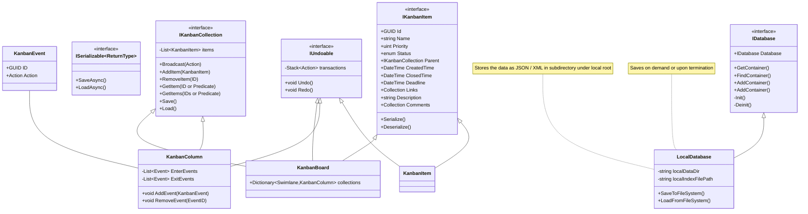

```mermaid
classDiagram
    class IUndoable {
        <<interface>>
        -Stack~Action~ transactions
        +void Undo()
        +void Redo() 
    }
    class ISerializable~ReturnType~{
        <<interface>>
        +SaveAsync()
        +LoadAsync()
    }

    class IDatabase{
        <<interface>>
        +IDatabase Database        
        +GetContainer()
        +FindContainer()
        +AddContainer()
        +AddContainer()
        -Init()
        -Deinit()
    }

    class IKanbanCollection {
        <<interface>>
        -List~KanbanItem~ items
        +Broadcast(Action)
        +AddItem(KanbanItem)
        +RemoveItem(ID)
        +GetItem(ID or Predicate)
        +GetItems(IDs or Predicate)
        +Save()
        +Load()
    }

    class IKanbanItem {
        <<interface>>
        +GUID Id
        +string Name
        +uint Priority
        +enum Status
        +IKanbanCollection Parent
        +DateTime CreatedTime
        +DateTime ClosedTime
        +DateTime Deadline
        +Collection Links
        +string Description
        +Collection Comments
        +Serialize()
        +Deserialize()
    }

    class LocalDatabase{
        -string localDataDir
        -string localIndexFilePath
        +SaveToFileSystem()
        +LoadFromFileSystem()
    }
    note for LocalDatabase "Stores the data as JSON / XML in subdirectory under local root"
    note for LocalDatabase "Saves on demand or upon termination"

    class KanbanBoard {
        +Dictionary~Swimlane,KanbanColumn~ collections
    }
    class KanbanColumn {
        -List~Event~ EnterEvents
        -List~Event~ ExitEvents
        +void AddEvent(KanbanEvent)
        +void RemoveEvent(EventID)
    }
    class KanbanEvent {
        +GUID ID
        +Action Action
    }
    
    IDatabase <|-- LocalDatabase
    IKanbanCollection <|-- KanbanBoard
    IKanbanItem <|-- KanbanBoard
    IUndoable <|-- KanbanBoard
    IKanbanCollection <|-- KanbanColumn
    IUndoable <|-- KanbanColumn
    IKanbanItem <|-- KanbanItem
    IUndoable <|-- KanbanItem
    KanbanEvent -- KanbanColumn
```
