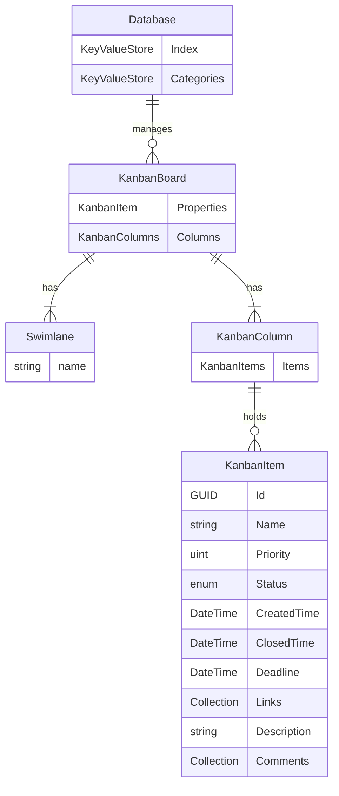

```mermaid
erDiagram
    Database ||--o{ KanbanBoard : manages
    KanbanBoard ||--|{ Swimlane : has
    KanbanBoard ||--|{ KanbanColumn : has
    KanbanColumn ||--o{ KanbanItem : holds

    Database {
        KeyValueStore Index
        KeyValueStore Categories
    }
    KanbanBoard {
        KanbanItem Properties
        KanbanColumns Columns
    }
    Swimlane {
        string name
    }
    KanbanColumn {
        KanbanItems Items
    }
    KanbanItem {
        GUID Id
        string Name
        uint Priority
        enum Status
        DateTime CreatedTime
        DateTime ClosedTime
        DateTime Deadline
        Collection Links
        string Description
        Collection Comments
    }
```