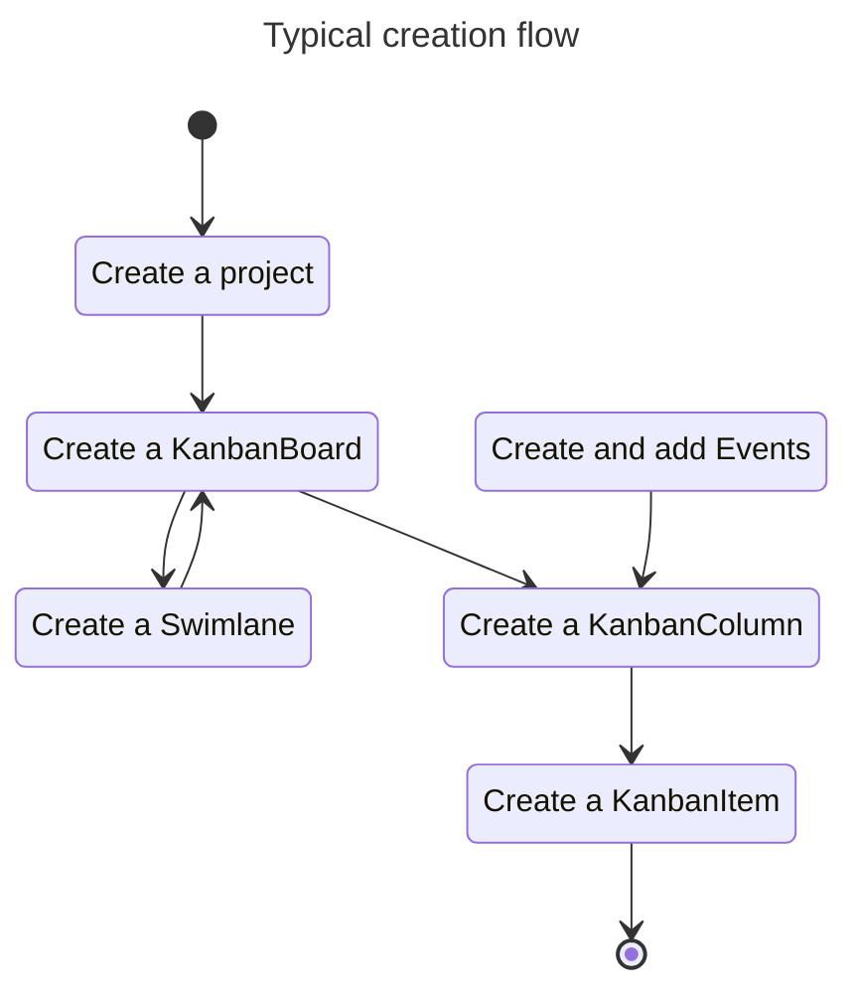
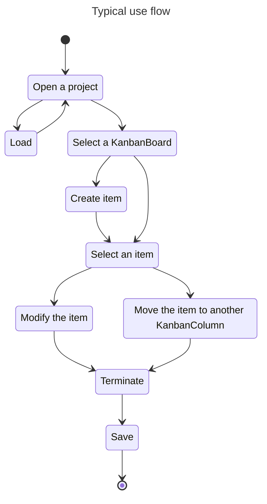
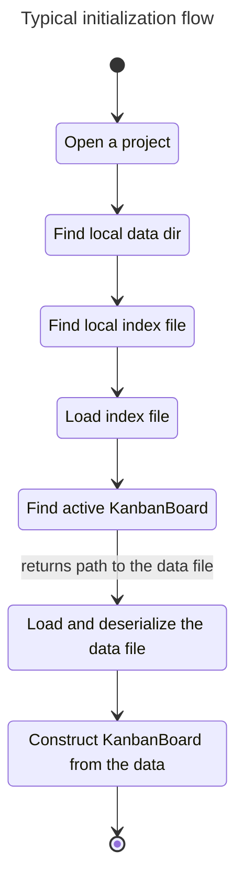
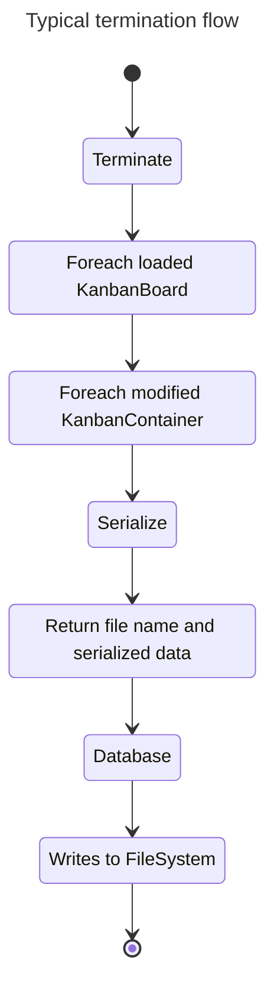

```mermaid
---
title: Typical creation flow
---
stateDiagram-v2
    state "Create a project" as proj
    state "Create a KanbanBoard" as board
    state "Create a Swimlane" as lane
    state "Create a KanbanColumn" as column
    state "Create and add Events" as event
    state "Create a KanbanItem" as item
    
    [*] --> proj
    proj --> board
    board --> lane
    lane --> board
    board --> column
    event --> column
    column --> item
    item --> [*]
```

```mermaid
---
title: Typical use flow
---
stateDiagram-v2
    state "Open a project" as proj
    state "Load" as load
    state "Select a KanbanBoard" as board
    state "Create item" as item
    state "Select an item" as select
    state "Modify the item" as modify
    state "Move the item to another KanbanColumn" as move
    state "Terminate" as end
    state "Save" as save
    
    [*] --> proj
    proj --> load
    load --> proj
    proj --> board
    board --> item
    item --> select
    board --> select
    select --> modify
    select --> move
    modify --> end
    move --> end
    end --> save
    save --> [*]
```

```mermaid
---
title: Typical initialization flow
---
stateDiagram-v2
    state "Open a project" as proj
    state "Find local data dir" as dir
    state "Find local index file" as index
    state "Load index file" as loadIndex
    state "Find active KanbanBoard" as board
    state "Load and deserialize the data file" as loadFile
    state "Construct KanbanBoard from the data" as loadBoard
    
    [*] --> proj
    proj --> dir
    dir --> index
    index --> loadIndex
    loadIndex --> board
    board --> loadFile: returns path to the data file 
    loadFile --> loadBoard
    loadBoard --> [*]
```

```mermaid
---
title: Typical termination flow
---
stateDiagram-v2
    state "Terminate" as term
    state "Foreach loaded KanbanBoard" as board
    state "Foreach modified KanbanContainer" as container
    state "Serialize" as serialize
    state "Return file name and serialized data" as data
    state "Database" as database
    state "Writes to FileSystem" as write
    
    [*] --> term
    term --> board
    board --> container
    container --> serialize
    serialize --> data
    data --> database
    database --> write
    write --> [*]
```