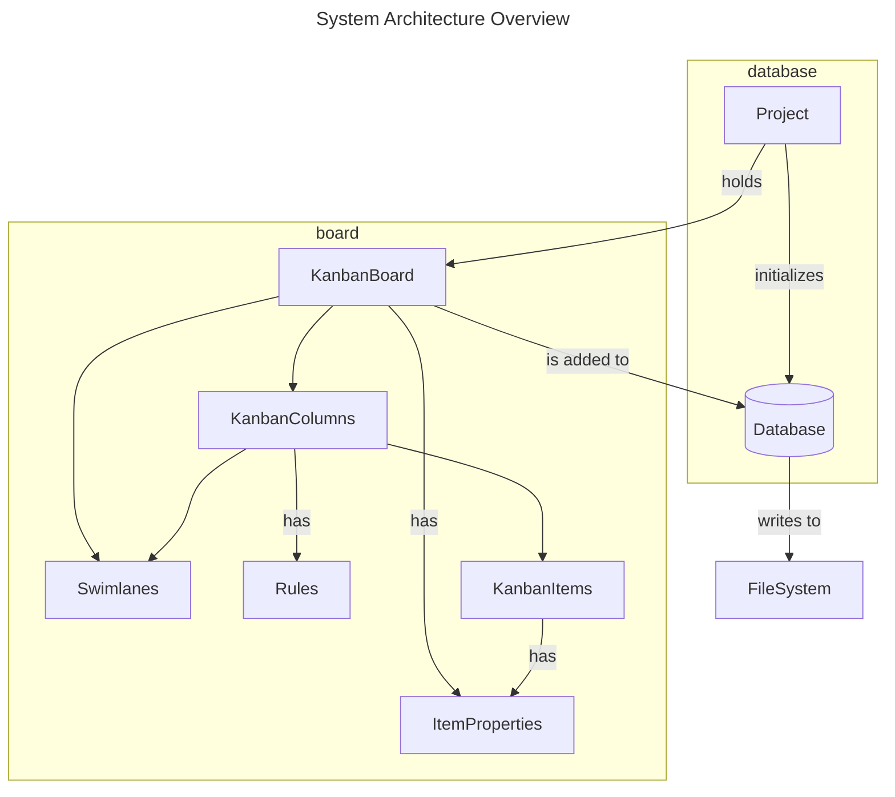

```mermaid
---
title: System Architecture Overview
---
flowchart TD
    subgraph database
    Project -- initializes --> Database[(Database)]
    end
    subgraph board
    Project -- holds --> Board[KanbanBoard]
    Board -- has --> Properties[ItemProperties]
    Board --> Swimlanes
    KanbanColumns --> Swimlanes
    KanbanColumns -- has --> Rules
    Board --> KanbanColumns --> KanbanItems
    KanbanItems -- has --> Properties
    end
    Board -- is added to --> Database
    Database -- writes to --> FileSystem
```
